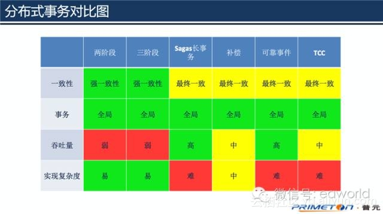
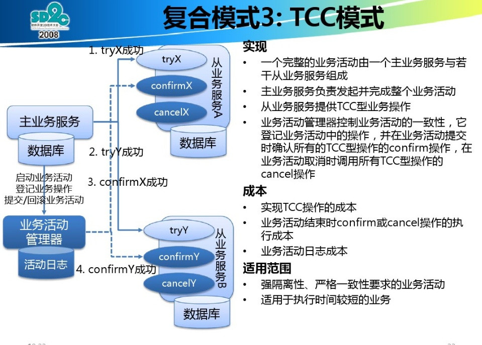
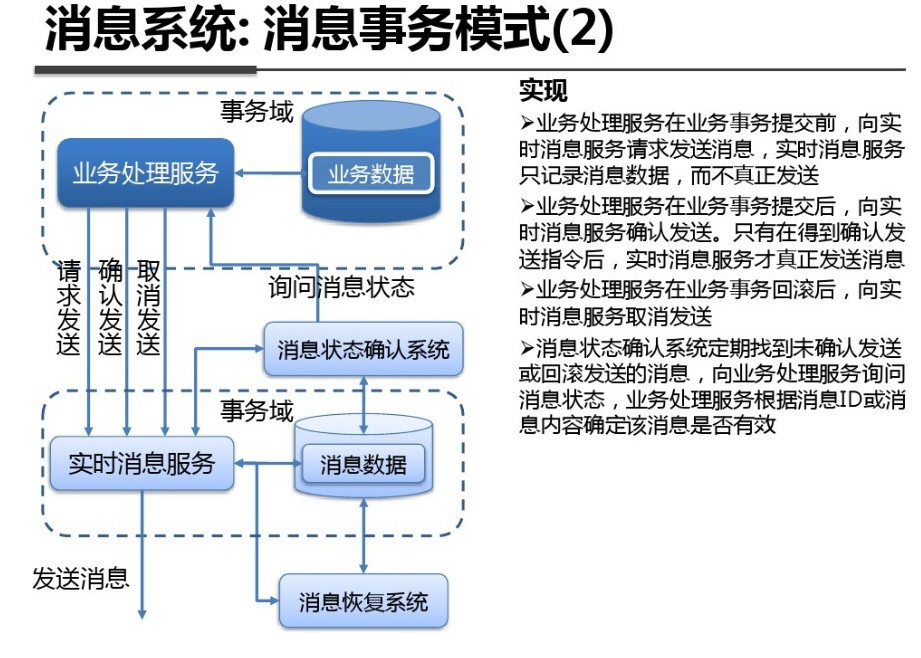

## 分布式基础
概述：本文介绍在分布式系统基本的理论基础，针对一些关键的机制做了详细的解释并用具体的商业产品进行解释。

### 基本概念

* 节点Node：独立的程序服务，可能是同一个进程下的服务，也可能是同台机器的不同进程
* 通信： 通过网络进行通信
* 存储：数据的持久化，就是数据写入磁盘或者SSD中
* 异常：机器宕机，网络异常，存储数据异常，请求的三状态成功，超时，异常错误

### 数据/节点的分布（Sharding分片）

* Hash方式
* 按数据范围分布
* 按数据量分布
* 一致性Hash
* 本地化计算

### 高可用（Replication副本）
概述：在分布式系统当中，为了提供高可用的服务，避免网络分化，机器宕机等导致的服务/数据不可用的情况发生，一般都会为服务/数据提供多副本的机制，副本是指在分布式系统中为数据/服务提供的重复性，对于数据副本是指在不同的节点上持久化相同一份数据，当出现某一个几点上存储的数据发生丢失时，可以从其他的副本上读取数据。数据副本是分布式系统解决数据丢失异常的唯一手段；另一类服务副本是指在大规模的分布式无状态的计算模型下，在不同的节点部署了相同的服务。

GFS系统中的Chunk的数个副本就是典型的数据副本模型，MapReduce系统的JobWorker则是典型的服务副本模型。

#### 副本协议

* 中心化副本控制协议
	* 主从架构的中心化副本控制协议
		* 数据更新流程
		* 数据读取方式 
		* Primary 副本的确定和切换
		* 数据同步(reconcile)
* 去中心化副本控制协议

* 实践 
	这里简要分析几种典型的分布式系统在副本控制协议方面的特点。工程中大量的副本控制协议 都是primary-secondary 型协议。从下面这些具体的分布式系统中不难看出,Primary-secondary 型副本控制协议虽然简单,但使用却极其广泛。

* GFS中的Primary-Secondary协议
	GFS 系统的副本控制协议是典型的 Primary-Secondary 型协议,Primary 副本由 Master 指定, Primary 副本决定并发更新操作的顺序。虽然在 GFS 中,更新操作的数据由客户端提交,并在各个副本之间流式的传输,及由上一个副本传递到下一个副本,每个副本都即接受其他副本的更新,也向下更新另一个副本,但是数据的更新过程完全是由 primary 控制的,所以也可以认为数据是由 primary 副本同步到 secondary 副本的。

* PNUTS中的Primary-Secondary协议
	PNUTS 的副本控制协议也是典型的 primary-secondary 型协议。Primary 副本负责将更新操作向 YMB 中提交,当更新记录写入 YMB 则认为更新成功。YMB 本身是一个分布式的消息发布、订阅 系统,其具有多副本、高可用、跨地域等特性。Secondary 副本向 YMB 订阅 primary 发布的更新操 作,当收到更新操作后,secondary 副本更新本地数据。从而,数据的更新过程也完全是由 primary 副本进行控制的。

*  Niobe中的Primary-Secondary协议
	Niobe 协议又是一个典型的 primary-secondary 型协议。Niobe 协议中,primary 信息由 GSM 模块维护,更新操作由 primary 副本同步到 secondary 副本。

* Dynamo/Cassandra的去中心化副本控制协议
	Dynamo / Cassandra 使用基于一致性哈希的去中心化协议。虽然 Dynamo 尝试通过引入 Quorum 机制和 vector clock 机制解决读取数据的一致性问题,但其一致性模型依旧是一个较大的问题。由于 缺乏较好的一致性,应用在编程时的难度被大大增加了。本文在 2.4.6 中较为详细的分析了 Dynamo 的一致性模型及其优缺点。

* Chubby/Zookeeper的副本控制协议
	Chubby[13]和 Zookeeper 使用了基于 Paxos 的去中心化协议选出 primary 节点,但完成 primary 节点的选举后,这两个系统都转为中心化的副本控制协议,即由 primary 节点负责同步更新操作到 secondary 节点。本文在 2.8.6 中进一步分析这三个系统的工作原理。

* Megastore的副本控制协议
	虽然都使用了 Paxos 协议,但与 Chubby 和 Zookeeper 不同的是,Megastore 中每次数据更新操 作都基于一个改进的 Paxos 协议的实例,而不是利用 paxos 协议先选出 primary 后,再转为中心化的 primary-secondary 方式[12]。另一方面,Megastore 又结合了 Primary-secondary 本文在 2.8.6 中进一 步分析 Megastore 使用 paxos 的工作原理。 

#### 副本的一致性
概述：分布式心跳通过副本控制协议，是的从系统外部读取系统内部各个副本的数据在一定的约束条件下是相同的，根据条件的约束，分为：

* 强一致性：

* 单调一致性：

* 会话一致性：

* 最终一致性：

* 弱一致性：一旦某一个更新成功，用户无法再一个确定时间内读到这次更新的值，即使在某个副本上读到新的值，也不能保证能在其他副本中读取到最新的值。

分布式的一致性相关协议：




* Lease机制

	Lease就是一把带有超时机制的分布式锁，如果没有Lease，分布式环境中的锁可能会因为锁拥有者的失败而导致死锁，有了lease，死锁会被控制在超时时间之内，也就是说Lease是由颁发者授予的在某一有效期内的承诺。

	Lease 机制依赖于有效期,这就要求颁发者和接收者的时钟是同步的。一方面,如果颁发者的 时钟比接收者的时钟慢,则当接收者认为 lease 已经过期的时候,颁发者依旧认为 lease 有效。接收 者可以用在 lease 到期前申请新的 lease 的方式解决这个问题。另一方面,如果颁发者的时钟比接收 者的时钟快,则当颁发者认为 lease 已经过期的时候,接收者依旧认为 lease 有效,颁发者可能将 lease 颁发给其他节点,造成承诺失效,影响系统的正确性。对于这种时钟不同步,实践中的通常做法是 将颁发者的有效期设置得比接收者的略大,只需大过时钟误差就可以避免对 lease 的有效性的影响。
	
	Lease 的有效期虽然是一个确定的时间点,当颁发者在发布 lease 时通常都是将当前时间加上一 个固定的时长从而计算出lease的有效期；工程中,常选择的 lease 时长是 10 秒级别,这是一个经过验证的经验值,实践中可以作为参考并综合选择合适的时长。

	* GFS中的Lease
		
		GFS 中使用 Lease 确定 Chuck 的 Primary 副本。Lease 由 Master 节点颁发给 primary 副本,持有 Lease 的副本成为 primary 副本。Primary 副本控制该 chuck 的数据更新流量,确定并发更新操作在 chuck 上的执行顺序。GFS 中的 Lease 信息由 Master 在响应各个节点的 HeartBeat 时附带传递 (piggyback)。对于每一个 chuck,其上的并发更新操作的顺序在各个副本上是一致的,首先 master 选择 primary 的顺序,即颁发 Lease 的顺序,在每一任的 primary 任期内,每个 primary 决定并发更 新的顺序,从而更新操作的顺序最终全局一致。当 GFS 的 master 失去某个节点的 HeartBeat 时,只需待该节点上的primary chuck的Lease超时,就可以为这些chuck重新选择primary副本并颁发lease。

	* Chubby与Zookeeper中的Lease

		Chubby 中有两处使用到 Lease 机制。
	
		我们知道 chubby 通过 paxos 协议实现去中心化的选择 primary 节点(见 2.8.6 )。一旦某个节点 获得了超过半数的节点认可,该节点成为 primary 节点,其余节点成为 secondary 节点。Secondary 节点向 primary 节点发送 lease,该 lease 的含义是:“承诺在 lease 时间内,不选举其他节点成为 primary 节点”。只要 primary 节点持有超过半数节点的 lease,那么剩余的节点就不能选举出新的 primary。

		一旦 primary 宕机,剩余的 secondary 节点由于不能向 primary 节点发送 lease,将发起新的一轮 paxos 选举,选举出新的 primary 节点。这种由 secondary 向 primary 发送 lease 的形式与 niobe 的 lease 形 式有些类似。

		除了 secondary 与 primary 之间的 lease,在 chubby 中,primary 节点也会向每个 client 节点颁发 lease。该 lease 的含义是用来判断 client 的死活状态,一个 client 节点只有只有合法的 lease,才能与 chubby 中的 primary 进行读写操作。一个 client 如果占有 chubby 中的一个节点锁后 lease 超时,那 么这个 client 占有的 chubby 锁会被自动释放,从而实现了利用 chubby 对节点状态进行监控的功能。 另外,chubby中client中保存有数据的cache,故此chubby的primary为cache的数据颁发cache lease, 该过程与 2.3.1 中介绍的基于 lease 的 cahce 机制完全类似。虽然相关文献上没有直接说明,但笔者 认为,chubby的cache lease与primary用于判断client死活状态的lease是可以合并为同一个lease 的,从而可以简化系统的逻辑。

		与 Chubby 不同,Zookeeper 中的 secondary 节点(在 zookeeper 中称之为 follower)并不向 primary 节点(在zookeeper中称之为leader)发送lease,zookeeper中的secondary节点如果发现没有primary 节点则发起新的 paxos 选举,只要 primary 与 secondary 工作正常,新发起的选举由于缺乏多数 secondary 的参与而不会成功。与 Chubby 类似的是,Zookeeper 的 primary 节点也会向 client 颁发 lease, lease 的时间正是 zookeeper 中的 session 时间。在 Zookeeper 中,临时节点是与 session 的生命期绑定 的,当一个 client 的 session 超时,那么这个 client 创建的临时节点会被 zookeeper 自动删除。通过监 控临时节点的状态,也可以很容易的实现对节点状态的监控。在这一点上,zookeeper 和 chubby 完 全是异曲同工。

* Paxos：
	该协议是一种去中心化的分布式一致性协议，该协议算法中包含的角色包含三种：Proposer(协议发起者)，Accepter(参与投票者)，Learner(学习者)；在发起Paxos协议的时候Proposer，Accepter都会有两个过程，Prepare(准备阶段)，Accept(批准阶段)。
	
	* Proposer的过程：
		
		准备阶段：
			
		* 向所有的Acceptor发送Prepare(b)消息.（b代表的是发起的paxos协议的轮数，是自增的，许多参考paxos的分布式一致性协议中的b可能是有一组数据的组成。）
		* 如果收到任何一个Reject（B）,则放弃这轮paxos协议，然后将b设置成B+1，然后重复第一步。（其中B是Acceptor返回的其本地进行的轮数b。）
		
		批准阶段：根据返回确认消息的不同会做出不同的选择
		
		* 如果收到Promise(b,v_i)消息达到N/2+1(既达到集群数量的一半以上)就认为是投票得到批准，开始进行投票成功通知操作（其中b表示Proposer发起的最新一轮投票，v_i表示Acceptor最新一轮（本地B）的值v）
			* 如果收到Promise(b,v)消息中，v都为空,选择其中一个v为值，广播Accept(b,v)
			* 否则在所有收到的Promise(b,v_i)中选择i最大的v，广播Accept(b,v)
		* 如果收到Nack(B),将轮数b设置为B+1后重新步骤1.
			
	* Acceptor的过程：

		准备阶段：
			
		* 接受某一个Proposer的消息Prepare(b),如果Acceptor本地的轮数B>b的话，则回复Reject(B),否则回复Promise(b,V_B)，设置B=b.
		批准阶段：
		*接收Accept(b,v)，如果b<B,回复Nack(B),否则设置V=v,表示批准该提案。
			
* Raft

	Raft是工程化中非常有名且有效的分布式一致性算法，本次关注：Leader选举和日志的部分（对应Lab 2A与2B），下节关注：持久化、客户端行为和快照（Lab 2C和Lab 3）

	Raft是Paxos算法的简化版本，基于自动机复制(state machine replcation)，即所有备份节点都执行相同的命令序列，以求得到相同的结果。核心问题就是要处理脑裂的问题，实现的基础在于保证“大多数”节点还是存活的，这里的“大多数”（quorm）指总数中超过半数。

	Raft使用日志作为复制的单位载体（仅利用KV DB来维护状态并不够），思路是编号定序与方便存储，编号定序保证复制命令执行顺序性，存储保证消息可靠性。

	Raft设计的两个难点：

	选择新leader
	保证日志执行顺序，即使出现各种失效
	
	Lab2A就是要实现一个选主算法。

	首先考虑为何要选出leader？可以简化设计，保证其他节点执行按相同顺序执行相同命令。Raft使用term概念标记leader顺序，一个term中最多一个leader（可能没有leader），帮助其他节点找到最新的leader。

	何时开始选主？节点发现收到主节点通信时，增加自己的term值，发起选举。注意这样可能导致不必要的选举过程，但是安全；也可能出现原leader还存活并且自认还是leader的情况。旧leader仅会影响“小部分”节点，大多数不会执行它的指令。

	如何保证只有最多一个leader获胜？所有节点每轮只需投票一次，回应第一个询问的节点。获得“大多数“”节点投票信息的leader获胜。其他节点通过接收主节点的AppendEntries和心跳信息得知leader的获胜与存活。可能出现没有leader胜出的情况【活锁问题】，此时会超时并重新发起选举（term值递增）。

	如何选择超时时间？至少几个心跳时间，节点随机选择长度，但要足够完成一轮选举。

	选主算法的工程实现要点

	节点需要维护的字段：
```
参数	解释
currentTerm	服务器最后一次知道的任期号（初始化为 0，持续递增），需要持久化
votedFor	在当前term获得选票的候选人 Id，需要持久化
log[]	日志条目集；每一个条目包含一个用户状态机执行的指令，和收到时的任期号，需要持久化
--	--
state	节点状态（Leader，Candidate，Follower）三种之一
commitIndex	已知的最大的已经被提交的日志条目的索引值
lastApplied	最后被应用到状态机的日志条目索引值（初始化为 0，持续递增）
--	--
nextIndex[]	对于每一个服务器，需要发送给他的下一个日志条目的索引值（初始化为领导人最后索引值加一），leader有用
matchIndex[]	对于每一个服务器，已经复制给他的日志的最高索引值，leader有用
节点可以发出两个RPC：

AppendLogEntries
平时的日志同步RPC，同时有心跳功能。

如果接收到的 RPC 请求中，term > currentTerm ，那么就令 currentTerm 等于 term，并切换状态为跟随者
Args参数	解释
term	领导人的任期号
leaderId	领导人的 Id，以便于跟随者重定向请求
prevLogIndex	新的日志条目紧随之前的索引值
prevLogTerm	prevLogIndex条目的任期值
entries[]	需要存储当然日志条目（表示心跳时为空；一次性发送多个是为了提高效率）
leaderCommit	领导人已经提交的日志的索引值
--	--
Reply返回值	解释
term	当前的任期号，用于领导人去更新自己
success	跟随者包含了匹配上 prevLogIndex 和 prevLogTerm 的日志时为真
RequestVoteFor
由候选人负责调用用来征集选票。

如果 term < 接收节点的currentTerm，则设置term并返回 voteGranted = false表示忽略这个选票
如果接收节点的 votedFor 为空或者等于 candidateId，并且lastLogXXX信息与自己的一样新，则继续返回投票
如果接收到的 RPC 请求中，term > currentTerm ，那么就令 currentTerm 等于 term，并切换状态为跟随者
Args参数	解释
term	候选人的任期号
candidateId	请求选票的候选人的 Id
lastLogIndex	候选人的最后日志条目的索引值
lastLogTerm	候选人最后日志条目的任期号
--	--
Reply返回值	解释
term	当前任期号，以便于候选人去更新自己的任期号
voteGranted	候选人赢得了此张选票时为真
节点线程模型

所有节点Follower启动一个检测线程，如果在超过选举超时时间的情况之前都没有收到Leader的心跳，或者是候选人请求投票的，就自己变成Candidate
变为Candidate启动一个选举线程，
自增当前的任期号（currentTerm）
给自己投票
重置选举超时计时器，选举超时时间是从一个固定的区间（例如 150-300毫秒）随机选择
发送请求投票的 RPC 给其他所有服务器
如果接收到大多数服务器的选票，那么就变成领导人
如果接收到的 RPC 请求中，term > currentTerm ，那么就令 currentTerm 等于 term，并切换状态为跟随者。注意在等待投票的时候，candidate可能会从其他节点接收到声明它是leader的AppendLogEntries RPC
成为Leader后启动一个心跳线程，定期发送心跳信息（100毫秒）
```
	
* 2PC
两阶段提交，组成有事务协调者和事务发起方，业务参与者，步骤是分为事务准备阶段和事务提交阶段。
  准备阶段：由事务发起方访问事务协调者，然后事务协调者发起一个分布式事务，然后向每一个事务参与者发起（prepare commit）操作，参与者可以失败，可以成功的（在本地执行事务，写本地的redo和undo日志，但不提交）响应给协调者，协调者收到所有参与者返回的信息，决定是执行全局回滚操作，还是提交（正式的commit）.
  提交阶段：根据第一阶段的的结果发起提交阶段的操作（行为是取决于第一阶段的结果，是commit，还是rollback），参与者收到操作,开始执行本地的提交事务或者rollback操作，然后把执行的结果返回给事务协调者。
  
以上就是两阶段提交的大致过程，你会发现这个过程在理想状态下是OK的，但是在分布式系统下会有许多不确定的因素，比如，宕机，网络不稳定等；因此我们会发现其存在以下大致的问题

    1、同步阻塞问题。执行过程中，所有参与节点都是事务阻塞型的。当参与者占有公共资源时，其他第三方节点访问公共资源不得不处于阻塞状态。

    2、单点故障。由于协调者的重要性，一旦协调者发生故障。参与者会一直阻塞下去。尤其在第二阶段，协调者发生故障，那么所有的参与者还都处于锁定事务资源的状态中，而无法继续完成事务操作。（如果是协调者挂掉，可以重新选举一个协调者，但是无法解决因为协调者宕机导致的参与者处于阻塞状态的问题）

    3、数据不一致。在二阶段提交的阶段二中，当协调者向参与者发送commit请求之后，发生了局部网络异常或者在发送commit请求过程中协调者发生了故障，这回导致只有一部分参与者接受到了commit请求。而在这部分参与者接到commit请求之后就会执行commit操作。但是其他部分未接到commit请求的机器则无法执行事务提交。于是整个分布式系统便出现了数据部一致性的现象。

    4、二阶段无法解决的问题：协调者再发出commit消息之后宕机，而唯一接收到这条消息的参与者同时也宕机了。那么即使协调者通过选举协议产生了新的协调者，这条事务的状态也是不确定的，没人知道事务是否被已经提交。
    
    5、第二阶段参与者中有部分是执行成功并返回给任务协调者但是有一部分参与者执行失败，这就导致整个系统的数据不一致的问题。

* 3PC
接下来让我们来看看三阶段提交时如何解决2PC所产生的问题的，3pc的组成角色和2PC是一致的，其优化的点分为以下两点

1、引入超时机制。同时在协调者和参与者中都引入超时机制。
2、在第一阶段之前插入一个确认阶段。保证了在最后提交阶段之前各参与节点的状态是一致的。

除了引入超时机制之外，3PC把2PC的准备阶段再次一分为二，这样三阶段提交就有CanCommit、PreCommit、DoCommit三个阶段。

  CanCommit阶段：该步骤和2PC的不走类似，但是该步骤下的参与者不锁定资源和写事务日志，只是一个确认达成共识的步骤
  PreCommit阶段：协调者根据参与者的反应情况来决定是否可以记性事务的PreCommit操作。根据响应情况，有以下两种可能。
    假如协调者从所有的参与者获得的反馈都是Yes响应，那么就会执行事务的预执行。

    1. 发送预提交请求 协调者向参与者发送PreCommit请求，并进入Prepared阶段。

    2. 事务预提交 参与者接收到PreCommit请求后，会执行事务操作，并将undo和redo信息记录到事务日志中。

    3. 响应反馈 如果参与者成功的执行了事务操作，则返回ACK响应，同时开始等待最终指令。
    假如有任何一个参与者向协调者发送了No响应，或者等待超时之后，协调者都没有接到参与者的响应，那么就执行事务的中断。

    1.发送中断请求 协调者向所有参与者发送abort请求。

    2.中断事务 参与者收到来自协调者的abort请求之后（或超时之后，仍未收到协调者的请求），执行事务的中断。
  DoCommit阶段：
  该阶段进行真正的事务提交，也可以分为以下两种情况。
  执行提交
  
      1.发送提交请求 协调接收到参与者发送的ACK响应，那么他将从预提交状态进入到提交状态。并向所有参与者发送doCommit请求。

      2.事务提交 参与者接收到doCommit请求之后，执行正式的事务提交。并在完成事务提交之后释放所有事务资源。

      3.响应反馈 事务提交完之后，向协调者发送Ack响应。

      4.完成事务 协调者接收到所有参与者的ack响应之后，完成事务。
  中断事务 协调者没有接收到参与者发送的ACK响应（可能是接受者发送的不是ACK响应，也可能响应超时），那么就会执行中断事务。

      1.发送中断请求 协调者向所有参与者发送abort请求

      2.事务回滚 参与者接收到abort请求之后，利用其在阶段二记录的undo信息来执行事务的回滚操作，并在完成回滚之后释放所有的事务资源。

      3.反馈结果 参与者完成事务回滚之后，向协调者发送ACK消息

      4.中断事务 协调者接收到参与者反馈的ACK消息之后，执行事务的中断。
  在doCommit阶段，如果参与者无法及时接收到来自协调者的doCommit或者rebort请求时，会在等待超时之后，会继续进行事务的提交。（其实这个应该是基于概率来决定的，当进入第三阶段时，说明参与者在第二阶段已经收到了PreCommit请求，那么协调者产生PreCommit请求的前提条件是他在第二阶段开始之前，收到所有参与者的CanCommit响应都是Yes。（一旦参与者收到了PreCommit，意味他知道大家其实都同意修改了）所以，一句话概括就是，当进入第三阶段时，由于网络超时等原因，虽然参与者没有收到commit或者abort响应，但是他有理由相信：成功提交的几率很大。 ）

其实3PC还是无法解决参与者数据不一致的问题，只是将不一致的问题发生的概率降低了

	
* Quorum
	WARO 牺牲了更新服务的可用性,最大程度的增强读服务的可用性。下面将 WARO 的条件进行松弛,从而使得可以在读写服务可用性之间做折中,得出 Quorum 机制。在 Quorum 机制下,当某次更新操作 wi 一旦在所有 N 个副本中的 W 个副本上都成功,则就称 该更新操作为“成功提交的更新操作”,称对应的数据为“成功提交的数据”。

	仅仅依赖 quorum 机制是无法保证强一致性的。因为仅有 quorum 机制时无法确定最新已成功提交的版本号,除非将最新已提交的版本号作为元数据由特定的元数据服务器或元数 据集群管理,否则很难确定最新成功提交的版本号。
	
	Clock Vector
	

	* GFS中的Quorum

		GFS 使用 WARO 机制读写副本,即如果更新所有副本成功则认为更新成功,一旦更新成功, 则可以任意选择一个副本读取数据;如果更新某个副本失败,则更显失败,副本之间处于不一致的 状态。GFS 系统不保证异常状态时副本的一致性,GFS 系统需要上层应用通过 Checksum 等机制自 行判断数据是否合法。值得注意的是 GFS 中的 append 操作,一旦 append 操作某个 chunck 的副本上 失败,GFS 系统会自动新增一个 chunck 并尝试 append 操作,由于可以让新增的 chunck 在正常的机 器上创建,从而解决了由于 WARO 造成的系统可用性下降问题。进而在 GFS 中,append 操作不保 证一定在文件的结尾进行,由于在新增的 chunk 上重试 append,append 的数据可能会出现多份重复的现象,但每个 append 操作会返回用户最终成功的 offset 位置,在这个位置上,任意读取某个副本 一定可以读到写入的数据。这种在新增 chunk 上进行尝试的思路,大大增大了系统的容错能力,提高了系统可用性,是一种非常值得借鉴的设计思路。

	* Dynamo中的Quorum
	
		Dynamo/Cassandra 是一种去中心化的分布式存储系统。Dynamo 使用 Quorum 机制来管理副本。 用户可以配置 N、R、W 的参数,并保证满足 R+W>N 的 quorum 要求。与其他系统的 Quorum 机制 类似,更新数据时,至少成功更新 W 个副本返回用户成功,读取数据时至少返回 R 个副本的数据。 然而 Dynamo 是一个没有 primary 中的去中心化系统,由于缺乏中心控制,每次更新操作都可能由 不同的副本主导,在出现并发更新、系统异常时,其副本的一致性完全无法得到保障。
	
		下面着重分析 Dynamo 在异常时副本的一致性情况。首先,Dynamo 使用一致性哈希分布数据, 理论上,即使出现一个节点异常,更新操作也可以顺着一致性哈希环的顺序找到 N 个节点完成。不 过,这里我们简化其模型,认为始终只有初始的 N 个副本,在实际中可以等效为网络异常造成用户 只能和初始的 N 个副本通信。更复杂的是,虽然可以沿哈希环找到下一个节点临时加入,但无法解 决异常节点又重新加入的问题,所以这里的这种简化模型是完全合理的。我们通过一个例子来考察 Dynamo 的一致性。
		
		例 2.4.6,在 Dynamo 系统中,N=3,R=2,W=2,初始时,数据 3 个副本(A、B、C)上的数 据一致,这里假设数据值都为 1,即(1,1,1)。
	
		某次更新操作需在原有数据的基础上增加新数据,这里假设为+1操作,该操作由副本A主导, 副本 A 成功更新自己及副本 C,由于异常,更新副本 B 失败,由于已经满足 W=2 的要求,返回用 户更新成功。此时 3 个副本上的数据分别为(2,1,2)。
		
		接着,进行新的更新操作,该操作需要在原有数据的基础上增加新数据,假设为+2 操作,假设 用户端由于异常联系副本 A 失败,联系副本 B 成功,本次更新操作由副本 B 主导,副本 B 读取本 地数据 1,完成加 2 操作后同步给其他副本,假设同步副本 C 成功,此时满足 W=2 的要求,返回用 户更新成功。此时 3 个副本上的数据分别为(2, 3, 3)。这里需要说明的是在 Dynamo 中,副本 C 必须 要接受副本 B 发过来的更新并覆盖自身数据,即使从全局角度说该更新与副本 C 上的已有数据是冲 突的,但副本 C 自身无法判断自己的数据是否有效。假如第一次副本 A 主导的更新只在副本 C 上 成功,那么此时副本 C 上的数据本身就是错误的脏数据,被副本 B 主导的这次更新覆盖也是完全应 该的。
	
		最后,用户读取数据,假设成功读取副本 A 及副本 B 上的数据,满足 R=2 的需求,用户将拿 到两个完全不一致的数据 2 与 3,Dynamo 将解决这种不一致的情况留给了用户进行。

		为了帮助用户解决这种不一致的情况,Dynamo 提出了一种 clock vector 的方法,该方法的思路就是记录数据的版本变化,以类似 MVCC(2.7 )的方式帮助用户解决数据冲突。所谓 clock vector 即记录了数据变化的路径的向量,为每个更新操作维护分配一个向量元素,记录数据的版本号及主 导该次更新的副本名字。接着例 2.4.7 来介绍 clock vector 的过程。

		例 2.4.8:在 Dynamo 系统中,N=3,R=2,W=2,初始时,数据 3 个副本(A、B、C)上的数 据一致,这里假设数据值都为 1,即(1,1,1),此时三个副本的 clock vector 都为空([], [], [])。
		某次更新操作需在原有数据的基础上增加新数据,这里假设为+1操作,该操作由副本A主导, 副本 A 成功更新自己及副本 C,返回用户更新成功。此时 3 个副本上的数据分别为(2,1,2),而 三个副本的 clock vector 为([(1, A)], [], [(1, A)]),A、C 的 clock vector 表示数据版本号为 1,更新是 有副本 A 主导的。

		接着,进行新的更新操作,该操作需要在原有数据的基础上增加新数据,假设为+2 操作,假设 本次更新操作由副本 B 主导,副本 B 读取本地数据 1,完成加 2 操作后同步给其他副本,假设同步 副本 C 成功,。此时 3 个副本上的数据分别
		
		为(2, 3, 3),此时三个副本的 clock vector 为([(1, A)], [(1, B)], [(1, B)])。
		为了说明 clock vector,这里再加入一次+3 操作,并由副本 A 主导,更新副本 A 及副本 C 成功, 此时数据为(5, 3, 5),此时三个副本的 clock vector 为([(2, A), (1, A)], [(1, B)], [(2, A), (1, A)])。
	
		最后,用户读取数据,假设成功读取副本 A 及副本 B 上的数据,得到两个完全不一致的数据 5 与 3,及这两个数据的版本信息[(2, A), (1, A)], [(1, B)]。用户可以根据自定义的策略进行合并,例如 假设用户判断出,其实这些加法操作可以合并,那么最终的数据应该是 7,又例如用户可以选择保 留一个数据例如 5 作为自己的数据。

		由于提供了 clock vector 信息,不一致的数据其实成为了多版本数据,用户可以通过自定义策略 选择合并这些多版本数据。Dynamo 建议可以简单的按照数据更新的时间戳进行合并,即用数据时 间戳较新的数据替代较旧的数据。如果是简单的覆盖写操作,例如设置某个用户属性,这样的策略 是有效且正确的。然而类似上例中这类并发的加法操作(例如“向购物车中增加商品”),简单的用 新数据替代旧数据的方式就是不正确的,会造成数据丢失。

	* Zookeeper中的Quorum

		Zookeeper使用的paxos协议本身就是利用了Quorum机制,在2.8 中有详细分析,这里不赘述。 当利用 paxos 协议外选出 primary 后,Zookeeper 的更新流量由 primary 节点控制,每次更新操作, primary 节点只需更新超过半数(含自身)的节点后就返回用户成功。每次更新操作都会递增各个节 点的版本号(xzid)。当 primary 节点异常,利用 paxos 协议选举新的 primary 时,每个节点都会以自 己的版本号发起 paxos 提议,从而保证了选出的新 primary 是某个超过半数副本集合中版本号最大的副本。这个原则与 2.4.5 中描述的完全一致。值得一提的是,在 2.4.5 中分析到,新 primary 的版本号未必是一个最新已提交的版本,可能是一个只更新了少于半数副本的中间态的更新版本,此时新 primary 完成与超过半数的副本同步后,这个版本的数据自动满足 quorum 的半数要求;另一方面, 新 primary 的版本可能是一个最新已􏰀交的版本,但可能会存在其他副本没有参与选举但持有一个 大于新 primary 的版本号的数据(中间态版本),和 2.4.5 分析的一样,此时这样的中间态版本数据 将被认为是脏数据,在与新 primary 进行数据同步时被 zookeeper 丢弃。

	* Mola*/Armor*中的Quorum

		Mola*和 Armor*系统中所有的副本管理都是基于 Quorum,即数据在多数副本上更新成功则认 为成功。Mola 系统的读取通常不关注强一致性,而提供最终一致性。对于 Armor*,可以通过读取 副本版本号的方式,按 Quorum 规则判断最新已􏰀交的版本(参考 2.4.4 )。由于每次读数据都需要 读取版本号,降低了系统系统性能,Doris*系统在读取 Armor*数据时采用了一种优化思路:由于 Doris*系统的数据是批量更新,Doris*维护了 Armor*副本的版本号,并只在每批数据更新完成后再 刷新 Armor*副本的版本号,从而大大减少了读取 Armor*副本版本号的开销。

	* BigPipe*中的Quorum

		Big Pipe*中的副本管理也是采用了 WARO 机制。值得一提的是,Big Pipe 利用了 zookeeper 的 高可用性解决了 WARO 在更新失败时副本的不一致的难题。当更新操作失败时,每个副本都会尝试 将自己的最后一条更新操作写入 zookeeper。但最多只有一个副本能写入成功,如果副本发现之前已 经有副本写入成功后则放弃写入,并以 zookeeper 中的记录为准与自身的数据进行同步。另一方面, 与 GFS 更新失败后新建 chunck 类似,当 Big Pipe*更新失败后,会将更新切换到另一组副本,这组 副本首先读取 zookeeper 上的最后一条记录,并从这条更新记录之后继续提供服务。
	
		例如,一共有 3 个副本 A、B、C,某次更新操作在 A、B 上成功,各副本上的数据为(2,2, 1),此时3个副本一旦探测出异常,都会尝试向zookeeper写入最后的记录。如果A或B写入成功, 则意味着最后一次的更新操作成功,副本 C 会尝试同步到这条更新,新切换的副本组也会在数据 2 的基础上继续提供服务。如果 C 写入成功,则相当于最后一次更新失败,当副本 A、B 读到 zookeeper 上的信息后会将最后一个更新操作作为“脏数据”并回退掉最后一个更新操作,新切换的副本组也 只会在数据 1 的基础上继续提供服务。
	
		从这里不难看出,当出现更新失败时,最后一条更新操作成为类似 2.4.5 中的中间态数据。与 2.4.5 中的中间态数据的命运取决于是否能参与新 primary 的选举类似,Big Pipe*中这条中间态数据 的命运完全取决于是哪个副本抢先完成写 zookeeper 的过程。

### 待归类
vector clock：时钟向量，多版本数据修改

Gossip协议

### 日志技术
日志技术是宕机回复的主要技术之一，日志技术最初使用在数据库中，数据库使用其来做系统容错，宕机恢复数据的工作，常用的日志技术用：Redo Log,Undo Log,Redo/Undo Log,No Redo/No Undo Log。

* Redo Log: 更新操作记录记录到日志中，方便宕机后恢复数据
* Undo Log: 记录更新操作之前的状态。
* Redo/Undo Log
* No Redo/No Undo Log
* Check point： 定期将更新数据dump进入磁盘，该数据是某一个时间点的全量数据，方便后期通过日志来恢复或者同步数据，由于dump到磁盘需要时间，所以在进行该操作期间，有新的更新操作进行，这种情况的处理方案是：1.暂停更新服务；2，维护两个内存的哈希表，一个是check之前的，一个是check之后的。

### CAP理论与实践

1，P是分布式系统的起点，全称：network partition，常指拔网线和宕机，因为这两种现象，同伴是无法区分的，所以归为一类。分布式系统下，P是大概率事件，假设服务器开一年必宕机一次，则365台的集群必然天天宕机。数据分存这365台之上，则数据必然天天不完整。
你设计的分布式系统能容忍吗？绝大多数是不能，不能则

2，复制，是解决这一问题的标准做法

3，复制，引发了C

4，C引发了A

一致性（数据的一致性，ACID），高可用(快速的响应，即使是失败也能快速的响应)，分区容忍性，


### 分布式系统
分布式系统分为分布式存储系统，分布式计算系统，分布式的管理系统

分布式存储系统:

* 数据的分割
* 数据的多副本
* 数据的读写分离
* IPC通信
* 可用性保证
* 网络，硬件的异常处理

分布式计算系统:

* 分工方式
* 数据交换方式
* 支持的运算种类
* 通信处理
* 运算的状态管理
* 可用性保障

### ES
缺省情况，查询发出的请求数量为shard 的数量，可扩展
读，可以通过增加副本
复杂统计查询，瓶颈在mem/cpu/io
如果qps 要求高，主要需要靠缓存
写，通过增加机器
相对宽裕的shard数量
增加机器的时候，shard 可以自动调整到新加的机器，扩容方便

C，A
写 
by default, index operations only succeed if a quorum (>replicas/2+1) of active shards are available.
譬如3 个replica, ¾  个就可以
1个replication 的情况下，退化为one,只要有一个写成功就可以
不可用，有可能是由于master 不可用导致
读
只要一个就可以
public enum WriteConsistencyLevel {DEFAULT((byte) 0),  ONE((byte) 1),QUORUM((byte) 2),ALL((byte) 3);}
集群下有可能丢失数据
即使有primary + 2个replica, 这个是由于网络partition 导致Primary+1个replica, 更有可能导致，脑裂和数据的丢失
为了一致性，可以选write consistency level 为ALL setConsistencyLevel(WriteConsistencyLevel.ALL)

MASTER
选举master
从几个可以备选master 中选举
Master 负责shard 分配，判断shard 可用性，mapping 维护等
超过20台节点的集群，建议master 节点只做master,不放data
Master节点在网络分割等情况下，有可能不可用

### 分布式事务
[分布式事务](http://coolshell.cn/articles/10910.html)

* 最终一致性协议

	* 补偿模式：将消息的不可靠和处理失败的问题由单独的补偿方式来解决，需要提供补偿的接口来做，事务数据的补偿操作。
	* TCC(Try/Confirm/Cancel): 和两阶段提交有点类似，参与者提供的事务模型为（Try/Confirm/Cancel）
		
    * 可靠事件模式（非事务消息、事务消息）：

		* 非事务消息: 需要自身维护消息日志表，面临的问题是消息的发送方重复发送和消息的消费方的幂等设计

	 		```
        操作数据库成功，向MQ中投递消息也成功，皆大欢喜；
        操作数据库失败，不会向MQ中投递消息了；
        操作数据库成功，但是向MQ中投递消息时失败，向外抛出了异常，刚刚执行的更新数据库的操作将被回滚。
        	```
        * 事务消息: 采用一些支持分布式事务的消息中间件(RocketMQ,Notify）
        
        	```
        发送消息，并记录该消息的唯一序列,有一个消息状态协同系统，记录消息的状态。
		开始本地事务，准备commit或者rollback
		根据序列更新消息记录表中的状态，定期扫描消息状态协同系统的消息记录表，来确认消息是成功还是失败，来处理回滚。
			```
       
  
  + Quorum W+R>N：抽屉原理，数据一致性的另一种解决方案
  
    最后我还想提一下Amazon Dynamo的NWR模型。这个NWR模型把CAP的选择权交给了用户，让用户自己的选择你的CAP中的哪两个。

    所谓NWR模型。N代表N个备份，W代表要写入至少W份才认为成功，R表示至少读取R个备份。配置的时候要求W+R > N。 因为W+R > N， 所以 R > N-W 这个是什么意思呢？就是读取的份数一定要比总备份数减去确保写成功的倍数的差值要大。

    也就是说，每次读取，都至少读取到一个最新的版本。从而不会读到一份旧数据。当我们需要高可写的环境的时候，我们可以配置W = 1 如果N=3 那么R = 3。 这个时候只要写任何节点成功就认为成功，但是读的时候必须从所有的节点都读出数据。如果我们要求读的高效率，我们可以配置 W=N R=1。这个时候任何一个节点读成功就认为成功，但是写的时候必须写所有三个节点成功才认为成功。

    NWR模型的一些设置会造成脏数据的问题，因为这很明显不是像Paxos一样是一个强一致的东西，所以，可能每次的读写操作都不在同一个结点上，于是会出现一些结点上的数据并不是最新版本，但却进行了最新的操作。

    所以，Amazon Dynamo引了数据版本的设计。也就是说，如果你读出来数据的版本是v1，当你计算完成后要回填数据后，却发现数据的版本号已经被人更新成了v2，那么服务器就会拒绝你。版本这个事就像“乐观锁”一样。

    但是，对于分布式和NWR模型来说，版本也会有恶梦的时候——就是版本冲的问题，比如：我们设置了N=3 W=1，如果A结点上接受了一个值，版本由v1 -> v2，但还没有来得及同步到结点B上（异步的，应该W=1，写一份就算成功），B结点上还是v1版本，此时，B结点接到写请求，按道理来说，他需要拒绝掉，但是他一方面并不知道别的结点已经被更新到v2，另一方面他也无法拒绝，因为W=1，所以写一分就成功了。于是，出现了严重的版本冲突。

    Amazon的Dynamo把版本冲突这个问题巧妙地回避掉了——版本冲这个事交给用户自己来处理。

    于是，Dynamo引入了Vector Clock（矢量钟？!）这个设计。这个设计让每个结点各自记录自己的版本信息，也就是说，对于同一个数据，需要记录两个事：1）谁更新的我，2）我的版本号是什么。

    下面，我们来看一个操作序列：

    1）一个写请求，第一次被节点A处理了。节点A会增加一个版本信息(A，1)。我们把这个时候的数据记做D1(A，1)。 然后另外一个对同样key的请求还是被A处理了于是有D2(A，2)。这个时候，D2是可以覆盖D1的，不会有冲突产生。

    2）现在我们假设D2传播到了所有节点(B和C)，B和C收到的数据不是从客户产生的，而是别人复制给他们的，所以他们不产生新的版本信息，所以现在B和C所持有的数据还是D2(A，2)。于是A，B，C上的数据及其版本号都是一样的。

    3）如果我们有一个新的写请求到了B结点上，于是B结点生成数据D3(A,2; B,1)，意思是：数据D全局版本号为3，A升了两新，B升了一次。这不就是所谓的代码版本的log么？

    4）如果D3没有传播到C的时候又一个请求被C处理了，于是，以C结点上的数据是D4(A,2; C,1)。

    5）好，最精彩的事情来了：如果这个时候来了一个读请求，我们要记得，我们的W=1 那么R=N=3，所以R会从所有三个节点上读，此时，他会读到三个版本：

        A结点：D2(A,2)
        B结点：D3(A,2;  B,1);
        C结点：D4(A,2;  C,1)
    6）这个时候可以判断出，D2已经是旧版本（已经包含在D3/D4中），可以舍弃。
    7）但是D3和D4是明显的版本冲突。于是，交给调用方自己去做版本冲突处理。就像源代码版本管理一样。

    很明显，上述的Dynamo的配置用的是CAP里的A和P。

#### BASE

BASE理论

BASE是Basically Available（基本可用）、Soft state（软状态）和Eventually consistent（最终一致性）三个短语的简写，是由来自eBay的架构师Dan Pritchett在其文章BASE: An Acid Alternative注 中第一次明确提出的。BASE是对CAP中一致性和可用性权衡的结果，其来源于对大规模互联网系统分布式实践的总结，是基于CAP定理逐步演化而来的，其核心思想是即使无法做到强一致性(Strong consistency)，但每个应用都可以根据自身的业务特点，采用适当的方式来使系统达到最终一致性(Eventual consistency)。接下来我们着重对BASE中的三要素进行详细讲解。

* 基本可用
基本可用是指分布式系统在出现不可预知故障的时候，允许损失部分可用性——但请注意，这绝不等价于系统不可用。以下两个就是“基本可用”的典型例子。
响应时间上的损失：正常情况下，一个在线搜索引擎需要在0.5秒之内返回给用户相应的查询结果，但由于出现故障（比如系统部分机房发生断电或断网故障），查询结果的响应时间增加到了1～2秒。
功能上的损失：正常情况下，在一个电子商务网站上进行购物，消费者几乎能够顺利地完成每一笔订单，但是在一些节日大促购物高峰的时候，由于消费者的购物行为激增，为了保护购物系统的稳定性，部分消费者可能会被引导到一个降级页面。

* 弱状态
弱状态也称为软状态，和硬状态相对，是指允许系统中的数据存在中间状态，并认为该中间状态的存在不会影响系统的整体可用性，即允许系统在不同节点的数据副本之间进行数据同步的过程存在延时。
* 最终一致性
最终一致性强调的是系统中所有的数据副本，在经过一段时间的同步后，最终能够达到一个一致的状态。因此，最终一致性的本质是需要系统保证最终数据能够达到一致，而不需要实时保证系统数据的强一致性。
亚马逊首席技术官Werner Vogels在于2008年发表的一篇经典文章Eventually Consistent-
Revisited中，对最终一致性进行了非常详细的介绍。他认为最终一致性是一种特殊的弱一致性：系统能够保证在没有其他新的更新操作的情况下，数据最终一定能够达到一致的状态，因此所有客户端对系统的数据访问都能够获取到最新的值。同时，在没有发生故障的前提下，数据达到一致状态的时间延迟，取决于网络延迟、系统负载和数据复制方案设计等因素。
在实际工程实践中，最终一致性存在以下五类主要变种。
* 因果一致性（Causal consistency）
因果一致性是指，如果进程A在更新完某个数据项后通知了进程B，那么进程B之后对该数据项的访问都应该能够获取到进程A更新后的最新值，并且如果进程B要对该数据项进行更新操作的话，务必基于进程A更新后的最新值，即不能发生丢失更新情况。与此同时，与进程A无因果关系的进程C的数据访问则没有这样的限制。
* 读己之所写（Read your writes）
读己之所写是指，进程A更新一个数据项之后，它自己总是能够访问到更新过的最新值，而不会看到旧值。也就是说，对于单个数据获取者来说，其读取到的数据，一定不会比自己上次写入的值旧。因此，读己之所写也可以看作是一种特殊的因果一致性。
* 会话一致性（Session consistency）
会话一致性将对系统数据的访问过程框定在了一个会话当中：系统能保证在同一个有效的会话中实现“读己之所写”的一致性，也就是说，执行更能操作之后，客户端能够在同一个会话中始终读取到该数据项的最新值。
* 单调读一致性（Monotonic read consistency）
单调读一致性是指如果一个进程从系统中读取出一个数据项的某个值后，那么系统对于该进程后续的任何数据访问都不应该返回更旧的值。
* 单调写一致性（Monotonic write consistency）
单调写一致性是指，一个系统需要能够保证来自同一个进程的写操作被顺序地执行。

以上就是最终一致性的五类常见的变种，在实际系统实践中，可以将其中的若干个变种互相结合起来，以构建一个具有最终一致性特性的分布式系统。事实上，最终一致性并不是只有那些大型分布式系统才涉及的特性，许多现代的关系型数据库都采用了最终一致性模型。在现代关系型数据库中，大多都会采用同步和异步方式来实现主备数据复制技术。在同步方式中，数据的复制过程通常是更新事务的一部分，因此在事务完成后，主备数据库的数据就会达到一致。而在异步方式中，备库的更新往往会存在延时，这取决于事务日志在主备数据库之间传输的时间长短，如果传输时间过长或者甚至在日志传输过程中出现异常导致无法及时将事务应用到备库上，那么很显然，从备库中读取的数据将是旧的，因此就出现了数据不一致的情况。当然，无论是采用多次重试还是人为数据订正，关系型数据库还是能够保证最终数据达到一致——这就是系统提供最终一致性保证的经典案例。

总的来说，BASE理论面向的是大型高可用可扩展的分布式系统，和传统事务的ACID特性是相反的，它完全不同于ACID的强一致性模型，而是提出通过牺牲强一致性来获得可用性，并允许数据在一段时间内是不一致的，但最终达到一致状态。但同时，在实际的分布式场景中，不同业务单元和组件对数据一致性的要求是不同的，因此在具体的分布式系统架构设计过程中，ACID特性与BASE理论往往又会结合在一起使用。

